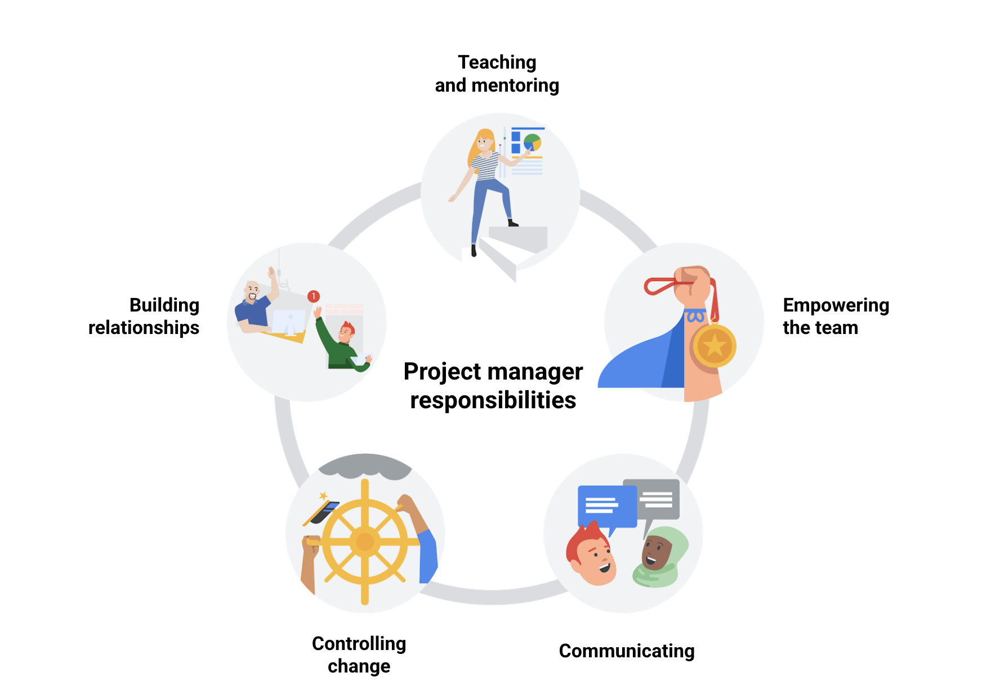

# Module 1

## Project management jobs and roles
This are various types of job you can do as a project manager

### Introductory level
Entry level for beginner

- Junior Project Manager
- Project Administrator
- Project Assistant
- Program Assistant
- Project Support Specialist

### Traditional roles
Your proper role
- Project Manager
- Project Analyst
- Project Lead
- Project Director
- Project Controller
- Technical Project Manager
- Project Management Office Analyst

### Program and Portfolio Management roles
These are senior roles
- Program Managers handles multiple projects simulataneously called programs. Program managers are basically project managers of different projects.
- Portfolio is a collection of projects and programs within the same organisation. As a Portfolio manager, you handle portfolio of projects and programs for a client/organisation. You will determine which ones should be prioritised, should get the go ahead and work with project managers of individual projects.

### Operational Management roles
These is a specialist role, super advanced or leadership roles

- Operations Analyst
- Operations Manager
- Chief Operating Officer

### Agile roles
This is a unique and growing field in project management
- Scrum master
- Project Owner

In addition to the roles listed above, there are industry specific roles, meaning they take on different terms, but the job is basically project management e.g. Construction (project) manager

## Job search

### Buzzwords
These are some of the words you should look out for when doing job search. You may want to add it to your CV too, to indicate that you're good at project management

The main ones are

- Coordination: getting people to work together
- Organisation: managing different tasks
- Leadership: being able to lead people

Others includes:
● Analytical
● Assertive
● Assessing outcomes
● Assessing progress
● Attention to detail
● Conflict resolution
● Collaborative
● Coordination
● Communication
● Development
● Evaluation
● Executing plans
● Financial analysis
● Impact assessment
● Leadership engagement
● Managing meetings
● Managing client expectations
● Managing conflicts
● Managing relationships with stakeholders
● Managing vendors
● Meeting deadlines
● Monitoring
● Multitasking
● Planning
● Prioritizing
● Problem-solving
● Process development
● Process improvement
● Project coordination
● Project implementation
● Project initialization
● Project planning
● Project reporting
● Quality control
● Risk assessment
● Risk management
● Solution development
● Strategic planning
● Strong interpersonal skills
● Strong verbal communication
● Strong written communication

Below are samples for job applications

### Job websites
- [Indeed](https://www.indeed.com/jobs?q=project+manager&explvl=entry_level)
- [LinkedIn](https://www.linkedin.com/jobs/search/?keywords=project%20manager)
- [Google Jobs](https://www.google.com/search?q=entry+level+project+manager+jobs&rlz=1CAOFPC_enUS954&oq=entry+level+project+management&aqs=chrome..69i57j0i457j0i402j0l2j69i60l2j69i61.4034j0j4&sourceid=chrome&ie=UTF-8&ibp=htl;jobs&sa=X&ved=2ahUKEwjI29asyM7xAhUEG80KHaDdA7oQutcGKAF6BAgEEAo#fpstate=tldetail&htivrt=jobs&htidocid=2CAdc0BclwAFy_uiAAAAAA%3D%3D)
- [Ziprecruiter](https://www.ziprecruiter.com/candidate/search?search=Project+Manager&location=New+York%2C+NY&days=&radius=5000&refine_by_salary=&refine_by_tags=&refine_by_title=&refine_by_org_name=)

# Module 2

## Impact of Project managers

1. Customers: making sure that the project meets customer's standard. They could be internal (stakeholders in companies) and external customers (clients, suppliers, consumers and contractors etc)
2. Team: They help build a great team
3. Foster relationship and communication among all those concerned
4. Managing project: Making sure all the tasks are done, and the project is completed
5. Breaking down barriers: They add values to the team, make the impossible possible

## Responsibilities of Project manager

The 5 core responsibilities of project managers requires interpersonal skills.

## Working in cross-functional team
To ensure that every team member work together in the most efficient way, the project manager must do the following
- Let each team member knows what exactly they are role is
- Get the right people for the job
- Keep track of the tasks and project progress
- Acknowledge individual and team effort

## Key Competencies
These are the things that the project manager must be good at

1. Enabling decision making: empower team members to make the right decision. Give them as many information as possible, and open door policy
2. Communicating and Escalating: Feedback and continuously keeping in touch with team and stakeholders
3. Strong organisation skills: plaining, scheduling, collaborating, documenting and quality assurance
4. Flexibility: Assess external constraints, plan for risk and challenges and calculate float in schedule
5. Handling ambiguity: people aren't always clear with their goals, requirement, vision etc. It is important to keep calm, express empathy, communicate, make decisions and trust your team

## Common myths
These are things people assume but are wrong about PM
- You need a lot of technical knowledge about the project: In fact, this might get in the way, and might have the PM focus on the little details instead of the big picture. PM hires expert, they don't need to be the experts
- You need to have lot of experience in the organisation: Experience is good, but it's not all
- You need to know every single details of the project: Well no, that would be micro-managing. Set goals and make sure it is reached

## Project Lifecycle
It's important not to rush through projects and handle each phase with care. These are the phases

1. Initiation: Get a clear understanding of what is expected of the project. This is where the PM identifies the skills required, timeline an cost of the project. Documentation of requirements and request to green-light project if they are satisfied
2. Making a plan: After the project has been approved, they make plan about the project from start to finish
3. Executing and completing tasks
4. Closing the project

### Initiate the project
In this phase, ask questions to help set the foundation for the project, such as:

- Who are the stakeholders?
- What are the client’s or customer’s goals?
- What is the purpose and mission of the project?
- What are the measurable objectives for the team?
- What is the project trying to improve?
- When does this project need to be completed?
- What skills and resources will the project require?
- What will the project cost? What are the benefits?

### Make a plan

- Create a detailed project plan. What are the major milestones? What tasks or deliverables make up each milestone?
- Build out the schedule so you can properly manage the resources, budget, materials, and timeline. Here, you will create an itemized budget.

### Execute the project

- Monitor your project team as they complete project tasks.
- Break down any barriers that would slow or stop the team from completing tasks.
- Help keep the team aware of schedule and deliverable expectations.
- Address weaknesses in your process or examine places where your team may need additional training to meet the project’s goals.
- Adapt to changes in the project as they arise.

### Close the project

- Identify that your team has completed all of the requested outcomes.
- Release your team so they can support other projects within the company.
- Take time with your team to celebrate your successes!
- Pass off all remaining deliverables and get stakeholder approval.
- Document the lessons you and your team learned during the project.
- Reflect on ways to improve in the future.

# Module 3

## Frameworks and Approaches

This is the method of getting job done. The most common approach are **Waterfall** and **Agile** method

Two popular methodologies is Lean methodologies also used are **Lean** and **Six sigma methodologies**.

### Lean manufacturing methodology
Originated in the manufacturing industry and uses 5s methods
- Sort: Remove all the items not needed for the current production. Focus on the bare
- Set in order: Arrange so that anyone that needs them know where to find them
- Shine: Clean your workspace everyday, do away with the clutter
- Standardize:  Perform the process in the same way every time.
- Sustain: Make a habit of maintaining correct procedures and instill this discipline in your team.

Lean uses **Kanban** scheduling to manage production.

### Six sigma
It's a way to ensure the highest quality and have seven (not six) principles

1. Always focus on the customer.
2. Identify and understand how the work gets done. Understand how work really happens.
3. Make your processes flow smoothly.
4. Reduce waste and concentrate on value.
5. Stop defects by removing variation.
6. Involve and collaborate with your team.
7. Approach improvement activity in a systematic way.

You can put the two methodologies together to create **Lean Six Sigma**

Information on project management could be found [here](https://www.teamwork.com/project-management-guide/project-management-methodologies/)

# Module 4

## Organisational structures
This is how the company is structured and the role of the PM in the organisation

- Classic organisational structure: Top-down hierarchy. You always have one person above you that you answer to directly

- [Matrix organisational structure](https://www.pmi.org/learning/library/matrix-organization-structure-reason-evolution-1837): You may have more than one person that you answer to directly

## Project Management Office
This is a group within an organisation that defines, sets and maintains project management standards. The functions includes
- Strategic planning and governance
- Best practices
- Common project culture
- Resource management
- Creation of project documentation, archives and tools

## Organisation culture
### The importance of Culture
- Identity of the organisation
- The people who work there
- How the company works, the process

### Things that makes the culture
If you want to learn about the culture, these are the things to focus on, the questions to ask

#### Atmosphere
- What is the company’s dress code?
- How do people typically share credit at this company?
- Is risk-taking encouraged, and what happens when people fail?
- How do managers support and motivate their team?
- How do people in this role interact with customers and users?
- When and how do team members give feedback to one another?
- What are some workplace traditions?
- What are some of the ways the company celebrates success?

#### Policies
Things like sick days, vacation, working flexibility etc

#### Processes
Things like onboarding

#### Values
- Mission and value statement
- Professional dev and career growth

### Company rituals
This can drive the culture, this includes
- Birthdays and holiday celebration
- Lunch breaks
- Employee interaction with each other and management

As the project manager, you are a change agent, so it's important to figure out what works and what doesn't work

## Change management
This is the process of delivering  completed project and getting other people in the org to adopt/accept it.
For example, if you change the website layout. While PM may not directly be in charge of this, you should consider it and ask the following questions

- How will the organization react to change?
- Which influencers can affect change?
- What are the best means of communication?
- What change management practices will lead to the successful implementation of my project?

### Best practices
Things you need to do for change management
- Be proactive: introduce the product as early as possible
- Communicate about upcoming changes: frequent updates to all stakeholders
- Follow consistent process
- Practice empathy
- Use tools like [flowcharts](https://www.lucidchart.com/pages/what-is-a-flowchart-tutorial), [culture mapping](https://www.strategyzer.com/library/the-culture-map-a-systematic-intentional-tool-for-designing-great-company-culture) and feedback mechanisms

To learn more about change management process

- [Change Management at the Project Level](https://www.prosci.com/blog/change-management-at-the-project-level)
- [5 Steps to Successful End-User Adoption](https://www.citrix.com/content/dam/citrix/en_us/documents/reference-material/5-steps-to-successful-end-user-adoption.pdf)
- [Change Management Framework](https://docs.google.com/presentation/d/1YMVERX1vBsknCjbCtsKFmHgWWZxFcO5A3urvWbWXKbs/template/preview?resourcekey=0-_V7hj-KwQu75EI2Y9qpsTw)