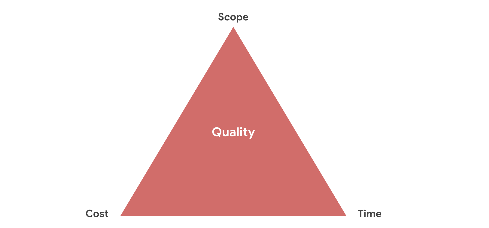
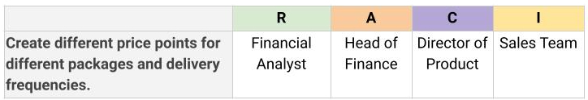

# Module 1

## Resources
- [Prince2](https://www.prince2.com/uk/resources) for certification, blogs and resources
- [Accessibility info](https://d3c33hcgiwev3.cloudfront.net/W9D-DrJBRWaQ_g6yQZVmQw_2f7a715255e546a59e7ef5ed0b1af205_Tips-for-accessible-content.pdf?Expires=1713916800&Signature=a7v1POLEGkxzAre9o4vQtE4RM3Ie-fjNu8AVO5Uz4D3fgcM4O9L0XPvZWdVXI2CMelZ4Ec3ecccqPTuUwZYWGyj-XAhhx7nzcKooN1TTxLj5cHyFbYeoL0hIya7xihCeylDpXyhKMoCo8bq176puHNqTkV-NF-kjInqZFfGYsxk_&Key-Pair-Id=APKAJLTNE6QMUY6HBC5A)

## Cost benefit analysis

Project cost money, so we need to know if we will get all our money back and more. Hence ROI is key in determining wether a project should get the greenlight

### Why
- Minimizes risks
- Maximizes gains
- Communicates needs and goals to stakeholders
- Reduces biases and self-interests
- Makes project justifiable
- Reduce waste and enable responsible investment

### Questions to ask

Below are possible benefits
- What value the project will create
- How much money would be saved
- How much revenue it will bring
- How much time it will save
- How will it improve customer experience

And then possible cost
- How much time will people spend on this project
- What's the one-time cost
- The ongoing cost
- Long time cost

And there are intangible benefits, that cannot be measured directly
- Customer satisfaction: increases customer retention
- Employee satisfaction: improve morale and reduce turnover
- Employee productivity: Reduce overtime and save money
- Brand perception
You can flip the question to determine intangible cost like reduction in customer satisfaction

### Return on Investment
The formula for calculating ROI is

- G is financial gain
- C is cost (upfront and ongoing)

## Project goals

This involve defining what you want for and from the project. This can be described by list listing the goals in SMART method or using OKR

### Smart goals

Each goal has to be
- Specific
- Measurable
- Achievable
- Relevant
- Time-bound

### Objectives and Key Results (OKRs)

So Objectives is what you want to define the desired outcome while Key results is where the objectives are quantified as measurable outcome

OKR could apply to a company, for a department or a project. As a PM, OKR could be useful to expand the goals and clarify deliverables. You can also OKR to motivate or challenge your team

#### Objectives

It should be
- Aspirational
- Aligned with organizational goals
- Action-oriented
- Concrete
- Significant

Whenever you are creating an objective, ask the following question

- Does the objective help in achieving the project’s overall goals?
- Does the objective align with company and departmental OKRs?
- Is the objective inspiring and motivational?
- Will achieving the objective make a significant impact?

Examples

- Increase market reach
- Provide a top-performing service

#### Key results

For each objective, you should have like 2-3 key results. It should be

- Results-oriented—not a task
- Measurable and verifiable
- Specific and time-bound
- Aggressive yet realistic

To help create a good key result, ask yourself the following question

- What does success mean
- What metrics would be used to prove that we achieved the object

Examples

- 20% new sign ups within first quarter after launch

### OKR vs SMART goals

SMART (Specific, Measurable, Achievable, Relevant and Time-bound)

While they both help with planning of projects, there are some considerable differences

- In OKR, Objectives define "why?", and the KR is basically SMART goals
- OKR are more aspirational, encouraging the journey while SMART focuses on getting somethings done
- OKR can be broad while SMART is very specific, measuring a single metric
- It's easy to tied SMART goals to compensation like do this and we will pay you this amount of money
- It's easy for SMART goals to devolve into meaningless to-do list. Some may even start creating easily attainable goals just to be busy and may lead to sandbagging

To learn more, [click here](https://www.smartsheet.com/content/okr-vs-smart-goals)

### Resources
- [Google’s OKR playbook](https://www.whatmatters.com/resources/google-okr-playbook)
- [Planning company goals](https://help.asana.com/hc/en-us/articles/17965094839067-Plan-and-manage-company-goals)
- OKRs and KPIs: [What They Are and How They Work Together](https://www.reflektive.com/blog/okrs-and-kpis-what-they-are-and-how-they-work-together/)
- [How OKR and project management work together](https://www.perdoo.com/resources/okr-and-project-management/)
- [OKR Examples](https://business.adobe.com/blog/basics/okr-examples)
- [OKR TED Talk](https://www.youtube.com/watch?v=L4N1q4RNi9I)

## Project Scope

Project scope refers to everything involved in successfully completing a project. It defines the boundaries of the project, including the deliverables, tasks, timeline, budget, and resources. The following needs to be considered

To determine this, you need to address the following

- Stakeholders: the reason and power behind the project
- Goals: what you hope to achieve
- Deliverables: quantifiable product
- Resources: all the things you will need to complete the project like materials, legalities
- Budget: Money
- Schedule: The timeline
- Flexibility: priorities, the non negotiable and non-negotiable

By defining all of these, you can avoid scope creep and differentiate between in-scope and out-of-scope

### Preventing project scope

- Define project requirement
- Set clear project schedule
- Define what is out of scope
- Provide alternatives if changes are needed
- Set up change control process: how changes will be defined, reviewed and approved/rejected
- Learn how to say no
- Collect cost for out-of-scope work

### Triple constraint

There are three things that determines a project
- Project scope
- Cost
- Time

Whenever you touch one, you have to adjust the other to comply. For example, an increase in project scope may lead to increase in cost and/xor time. A reduction in time may lead to reduction in project scope or increase in cost. This is the [triple constraint model](https://thedigitalprojectmanager.com/triple-constraint/). So whenever the stakeholder are trying to change any of these, you must assess the constraint and let them know the possible implication.

It's basically the inspiration behind you can't have it fast, cheap and good

## Measuring Success
Project launch is not the end of your job, making sure that the project is a success is part of it, after all, you don't create project for the sake of project itself, the purpose is for some tangible and intangible benefits to offset all the costs. Hence, it's important to also "land" the project

### Launching vs Landing a project

Project launch means delivering the final product to the client or user, the final results of our project. The other part is to land your project by measuring results based on the success criteria when setting SMART goals

### Launch first, land later
This happens when it takes long to long to assess the success criteria like 5 years. So you might want to check up on the project from time to time to see progress

### Launch and forget
This happens when your client the deliverables and forget about the project

# Module 2
## Project Quality

This involves tracking the extent to which the product is complete, that is, how many requirements was completed. Quality depends on the following
1. The number of priority requirement completed
2. Number of issues or defects
3. The percentage of features that you delivered at the end of the project

### Customers and Stakeholders

While metrics are important and provides an objective means, it's also important to be mindful of what stakeholders and customers want and their feedback. Hence, these metrics are also important

- User engagement
- Stakeholder and user satisfaction (via surveys)
- User adoption (sales data)

So it is important to manage stakeholders expectation when defining success criteria

## Evaluating progress

There are various methods to evaluate progress, depending on how you set the goals. First it's important to track the goals. For example using OKR

- There should be a checklist for each objective and key results
- Assign owners to each key result. This person is accountable for getting the result done.

### Measuring progress

#### Scoring expectations
- The easiest approach is binary, yes or no
- You can also grade your key results to see how close you are to completing it.
  - For example the percentage or ratio of task that has been completed
  - This is mor advance and may be more motivational
  - You can even colour code it, red (<33%), green (>66%) and yellow (anything between).
  - In this case, it also gives you leeway, like in Google where 60-70% is considered OK.
  - Lower than 60% means they are not doing OK and higher than 70% might mean that you're setting very easy goals

#### Schedule Checkpoints
Communicate regularly with your team, like every month to check on the progress and address any issues

# Module 3

## Building the dream team
- Team size: You don't want your team to be too big or too small
- Skills: You need someone who has the right technical skills, qualifications and/or abilities for the job
- Problem solving skills: You also need people that handle themselves under pressure and handle the unexpected
- Leadership skills: It could be helpful to find someone that can coordinate or gel the team together other you

### Finding the team
- Availability: Who is available in your team, organisation or the market
- Motivation: their source and level of motivation and how it might impact your team. You should also consider how to improve interest

## Essential Project roles

- Project manager: responsible for the success of the team and the project
- Stakeholders
- Team members
- Sponsor

### Stakeholders
This means anyone interested in the success of the project. There are two types
1. Primary stakeholders: also known as key stakeholders, they are directly affected by the outcome of the project. This includes customers, senior leaders, team members
2. Secondary stakeholders: indirectly affected. This includes business partners, trade unions, community etc

### Project sponsor
This is also a primary stakeholder. They initiate the project and responsible for the its existence. They are extremely important to a project

## Prioritising Stakeholders
There are lots of people interested in the success of a project and you need to determine how to interact with them and determine their importance

### Stakeholder analysis

You should go through the following list
1. Make a list of the stakeholders and figure out the following
   1. Their investment
   2. Their contribution
   3. How the project impacts them
2. Determine interest and influence. This will determine how key the stakeholder is
3. Assess their ability to participate, there are
   1. Active stakeholder: Wants to be fully involved
   2. Passive stakeholder: High level updates only, no need for day to day bit
You may need to set a **steering committee** during a project. This is a collection of key stakeholders with high power and interest in the project.

### Power grid
This is an handy way visualise your stakeholder analysis

#### Interacting with Stakeholders
This depends on the power grid

### High Influence and Interest
- Regular communication to keep them fully updated. They need to be supported and engaged
- Engagement and involved: They should be well informed, involved in decision making and address their concerns promptly

### High influence, Low interest
- Executive Summaries: High level summaries for key decisions and review, it's more about the goals and objectives
- Focuses on major milestone and critical protech changes

### Low influence, High interest
- Regular update and address their queries/concerns promptly
- Stakeholder feedback: talk about plans, progress and outcomes

### Low influence and interest
- General communication
- Minimal engagement

For more information about ordering stakeholders, [click here](https://www.pmi.org/learning/library/identify-prioritize-stakeholders-11408)

## RACI Chart
It is an extremely effective way to define roles based on the following
- Responsible: Who is going to do the work e.g. web dev creating a website
- Accountable: Who make sure the work is done e.g. head of dev. They may also decide who is responsible
- Consulted: Who give feedback or input on the work. They are usually Subject Matter Experts
- Informed: Who needs to know about the outcome

It is also known as Responsibility Assignment Matrix (RAM)

It is important to balance the chart, and make sure that there isn't too much workload or responsibility on one person. This also helps mitigating single points of failure (Creating silos)
You should also share your RACI with your stakeholders for them to sign off on it
Note, RACI is usually ideal for big projects and might end up slowing down very small projects

## Why project fail
There are lots of reasons that out of your hands that can cause a project to fail, but the main reason within your hand is Initiation missteps due to the following

- Unclear expectations: goals, deliverables, schedule, budget and stakeholders
- Unrealistic expectations
- Miscommunication
- Lack of resources
- Scope creep

# Module 4

## Project Charter

Clearly defines the necessary details for a project to reach its goals. This include
1. Introduction or Project summary
2. Goals or Objectives
3. Business case (Benefit and cost)
4. Project team
5. Scope
6. Success criteria
7. Major requirement (Key deliverables)
8. Budget
9. Schedule (Timeline or milestones)
10. Constraints and Assumptions
11. Risks
12. OKRs
13. Approvals

Project charter varies and depending on the complexity of the project, each component may lead to a separate document, link or resources.
It is a living document that can grow, and requires regular review and revisit

## Introducing new tools
After determining that a tool will be beneficial to the team, it is important to introduce the tool first, this shows that you have their best interest in mind not just the project. Go through the following step

1. Discuss the tool early and often: No sudden introduction that makes them feel blindsided
2. Feedback from key stakeholders: Let them know the cost and benefit the tool and their input
3. Ensure the tool is fully functional before introducing it to the team
4. Set up training before the team start using the tool