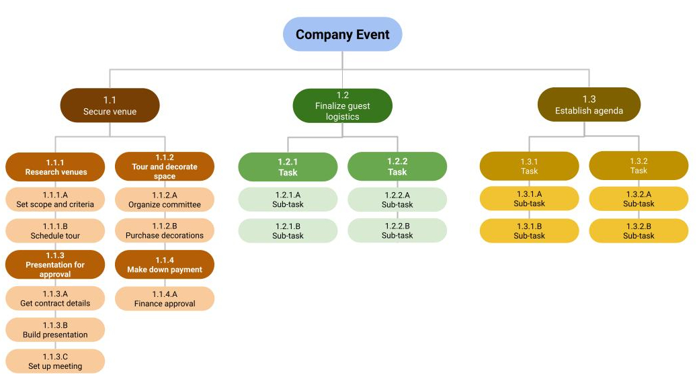

# Module 1

The project has been approved with all the resources needed, now the next step is to kick these off

## Kick-off meeting

This is the beginning of the project from your team's perspective, hence there are some things you need to get right for the meeting

- Set the right time: beware of zone differences
- The right length: It shouldn't be more than 1 hour. Focus on key information, questions and team building
- Invite the right people: You don't want to leave anyone out but shouldn't include those that are not needed
- Designate a note-taker: Documentation is important, tools like Chorus Notetaker, Google Keep, Docs or Microsoft OneNote will help
- Set the agenda: things like introduction, project background and purpose, goals, scope, roles, responsibilities, collaboration process, project tools and expectations, as well as questions and discussion
- Share the agenda before the meeting. Identify the speakers for each topic
- Follow up after meeting: Send meeting summary to attendee

## Setting Milestones

### Task vs Milestones

Task indicates an activity that needs to be accomplished while milestone indicate an important point in the project schedule, signifying a major deliverable.

A milestone contains 2 or more tasks.

### Defining milestones
Tasks can help you set milestones in one of the following ways
1. Top-down scheduling: Starts with high level milestones and then broken down into tasks
2. Bottom-up scheduling: Grouping together tasks into chunks (milestones).

### Pitfalls
- Too many milestones, this leads to diminished importance of those milestones. It may also make the project look much bigger than it's really is.
- Mistaking tasks for milestones: milestones shouldn't be too small or specific
- Separating tasks and milestones: All tasks should be listed under their milestones to create a visual idea of the project plan

## Work Breakdown Structure

[WBS](https://www.lucidchart.com/blog/how-to-create-a-work-breakdown-structure-and-why-you-should) helps us visualise the project in hierarchy method. It breaks it down into deliverables and then smaller component

1. Identify the milestones and deliverables
2. Break it down into tasks
3. You can break those tasks into sub tasks

# Module 2

## Project components
There are four aspects of projects that works hand in hand, all have been addressed so far
1. Scope and goals: Key details of project, usually in the project charter
2. Work Breakdown Structure: Milestones/Deliverables and tasks, as well as RACI chart
3. Budget
4. Management plans: Risk management, Communication plan etc

## Planning fallacy and Optimism bias

This is a field in behavioural economics that suggest that we tend to underestimate the time it will take to complete a task because we are inherently optimistic (most people believes negative things won't happen to them). It can happen to anyone regardless of their experience.
Hence after your initial time assignment, add buffers to it for unforeseen circumstances because it's unforeseeable, and hindsight is 20/20

## Critical Path

The path refers to all the milestones between the project start and completion. This involves the following

1. List all tasks
2. Create dependencies
3. Create network diagram
4. Make time estimates
5. Find the critical path

### Listing tasks
Listing all milestones and capturing all tasks to ensure that nothing is missing. It should focus on the need to do task and create a sort of story or plot.

### Create dependencies
Based on your list, figure out what task needs to be completed before each task can go ahead.

### Network diagrams
This allows you to easily visualise the necessary tasks, see concurrent tasks as well as those with pre-requisites

### Time estimates
Add the time necessary to complete each task

### Determine the critical path
Find the longest possible path to get the basic idea of how long the project will take. You can use the forward or backward pass, this basically mean adding from beginning to end and vice versa.
- [How to Use the Critical Path Method for Complete Beginners](https://www.workamajig.com/blog/critical-path-method)
- [Critical Path Method: A Project Management Essential](https://www.wrike.com/blog/critical-path-is-easy-as-123/)

## Coding tasks

You may have loads of tasks, and some with similar name or too long a statement. Hence it might be a good idea to use task ID numbers or task name. This would make it easier to reference in communication.

## Project plan
This is where all the tasks, task owners, task duration, start and end date. It can be done with a spreadsheet. It helps visualise the project

## Kanban board
You can use a physical board or a software like Trello or Asana. In a physical board, it can be divided into front and back
### Front
- Title and unique identifier
- Description of work
- Estimation of effort: amount of work required
- Who is assigned
### Back
- Start date
- Blocked date: Moments that you cannot work on the task for any reason
- Finish date

# Module 3

## Budgeting
This takes place in the Initiation and Planning phases of the project. Some tips to creating an accurate budget are
1. Reference historical data
2. Utilise the team, mentors and managers to get a more accurate data
3. Time-phase your budget: it makes it more manageable
4. Check, double check and re-check

## Categorising costs

You can break it into direct and indirect cost

### Direct cost

Necessary to complete project like
- Wages of employees
- Payment to contractors
- Buying or renting equipments
- Software cost
- Training cost
- Project related travels and transportation

### Indirect cost
The are often referred to as overhead cost. Examples includes
- Administrative cost
- Utilities
- Insurance
- Security
- Office equipments (not related directly to the project)

## Developing Budget

### Baseline budget
This is the estimate of the money that you start with. It is absolutely necessary to make sure the project proceed. You should monitor this and adjust it as needed. You should also re-baseline your budget if there is a significant change

### Reserve analysis
This is budget buffer and also known as contingency budget. You need to review all potential risk and create a contingency budget. You may also want to add cost of quality, which is the money used to buy a more expensive material because it's better even though a cheaper one will do the job just fine in case your stakeholder are willing to pay for the expensive stuff.

## Cash flow
This is the inflow and outflow of money. This is important for funding and keeping a project running.

Sometimes, you get all the money you need at the beginning and now have to monitor how you spend it, while sometimes, it a regular influx, which might mean you have to prioritise certain things till the next money comes in.

### Expenses

These can be categorised into two
- CAPEX (capital expense): long term and upfront cost like buildings, vehicles etc.
- OPEX (operating expense): Short term for day to day tasks like wages, rent and utilities. They are usually recurring.

Project managers needs to account for both of these expenses

### Contingency reserves

They are also referred to as buffers. They are used for possible risk that you've taken into account, also known as identified risk.

### Management reserves

Similar to contingency reserves but you for unidentified risk like meteor hit. Contigency reserves are usually estimated based on what we know why management reserves are just a percentage of the total cost, usually between 5 and 10%. The more complex the project is, the higher the percentage

## Procurement

This is the process of obtaining materials, services and supplies to complete a project. This involves 5 steps

1. Initiating: planning what you need to meet your project goals
2. Selecting: deciding which suppliers and vendors to use
3. Contract writing: developing, reviewing, and signing contracts
4. Controlling: making payments and maintaining and ensuring quality
5. Completing: measuring your success

Procurement is usually done with Statement of Work (SOWs) and you may need subject matter experts (SMEs) in each field to weigh in when it comes to their field

## Ethics

### Common ethical traps
- Corruption and bribery
- Sole-supplier sourcing: sometimes you may have a vendor that you're used to, and after a while, you don't even consider anyone else even if they are better for business. This may lead to some sort of favouritism
- State-owned entities: usually stricter and may have their own rules (that can be enforced by the law)

### Avoiding ethical traps
- Understand the legal requirements
- Stick to your codes

### Testing your ethics
These are ways to test if what you are about to do is ethical.
1. Shame: if people find out, will you feel ashamed
2. Community: Would you want your friend to know what you did
3. Legal: Could you face legal action
4. Situation: Can you justify the situation
5. Consequence: Would the negative consequences be worth the action

# Module 4

Risks are issues that may arise in your project. Effective risk management is important to make sure it's not the end of your project

## Risk managements
There are five phases of [risk management](https://www.projectmanager.com/blog/risk-management-process-steps)

1. Identify: you can only manage the risk that you know about. Do everything you can to identify all potential issues that may arise
2. Analyse the risk: Likelihood and the impact. The more serious and likely they are, the more dangerous they are. You can use a four quadrant to determine where each risk falls. 
3. Evaluate risk: Prioritise risks based on the analysis
4. Treat the risk: make plans on how to handle each risk should they arise
5. Monitor and control risk: Note if the risk arises and how to monitor, prevent or mitigate the risk

## Risk management as opportunities

While risk management is primarily meant to discover potential negative events, it can also help us identify possible positive outcome. For example additional resources were supposed to mitigate the risk but can now be used to complete the project ahead of time because the issue never arose.
So as a PM, you job is not just to identify risk but also potential benefits

## Tools for identifying risk

### Fishbone diagram

Also known as Ishikawa diagram or Cause-and-effect diagrams, they are visual way to show cause and effect. The purpose is to identify the root cause of a problem or risk.

There are  four steps to creating a fishbone.

1. Define the problem e.g. Trouble delivering products 
2. List all the possible causes of the problem
3. Categorise each problem . 
4. Analyse each causes and how to mitigate the problem 

## Single point of failure risks
If this kind of risk should happen, it could disrupt or even shut down the project. An example is if you have just one SME (Subject Matter Expert) in your team and they suddenly become unavailable when you need them for their critical role or a sudden shortage in the supply of the primary ingredient in manufacturing or increase in price due to tariffs

### Risk mitigation

There are four ways to mitigate risks namely
1. Avoid: e.g. get a new SME or buying from a new supplier
2. Minimise: walk around the issue like using a new supplier along with the old supplier
3. Transfer: let another person or institution handle the responsibility for example, instead of buy it from the old supplier, you can buy it from an intermediary, who might not be faced with the tariffs
4. Accept: If you can't do any of the above, you may passively or actively accept the risk. Active is like increasing the budget while passive is like waiting for your SME to get back

## Dependencies relationship
This denotes relationships between two project tasks

1. Finish to Start (FS): This indicate that Task A must be completed before Task B can start e.g. putting on your socks before your shoes
2. Finish to Finish (FF): Task A must be completed before you can complete Task B e.g. making the icing before you can decorate the cake
3. Start to Start (SS): Task A must start before Task B can start e.g. Researching or creating an outline before writing a report
4. Start to Finish (SF): Task A must start before Task B can be completed e.g. Some has to start their shift (takeover) before someone else finishes their shift

