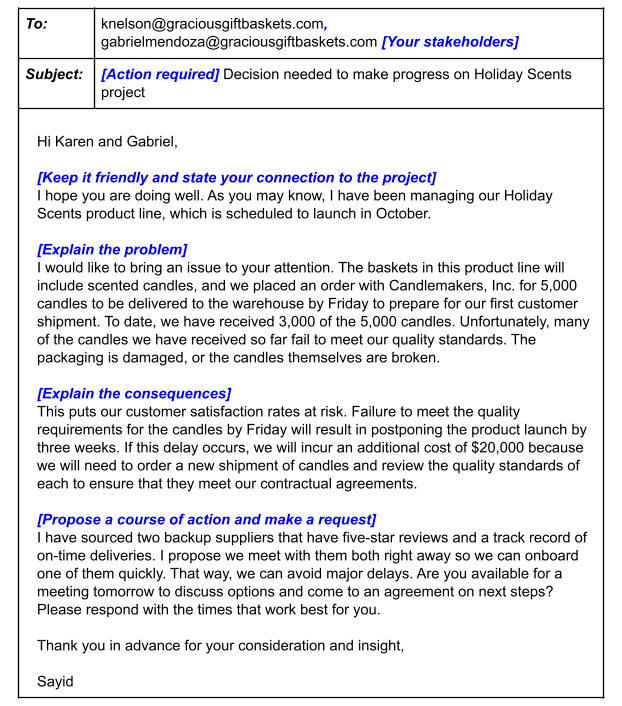

# Module 1

## Tracking progress
There are different ways to track projects, each having its own advantages and disadvantages.

### Gantt Chart
- Keep track of the schedule
- Good for project with lots of tasks, dependencies and milestones
- For large teams because responsibility are clearly laid out

Tools like Asana are good for creating gantt chart, as well as google sheet and microsoft excel

### Roadmaps

- High-level tracking of milestones
- It outlines the whole project and provides snapshot of key points
- It helps the stakeholder view how the project will evolve over time

Everything to know about roadmap on [smartsheet](https://www.smartsheet.com/content/project-roadmap-templates)

### Burndown charts
This is used by Agile Scrum teams, and useful for
- Detailed review of tasks
- When finishing on time is top priority

[Burndown](https://www.projectmanager.com/blog/burndown-chart-what-is-it) chart and how to use them on [Jira](https://www.atlassian.com/agile/tutorials/burndown-charts)

## Project status report

This gives you an overview of the project's elements and summarises them in snapshots. It should contain the following

1. Project name
2. Date: the status report is made many times throughout the implementation of the project, hence you need attack date. Report should be make regularly  e.g. weekly or monthly
3. Summary: Goals, schedule, highlights and lowlights.
4. Status: Illustrates actual progress, a common way is using RAG (red, amber and green). Red indicates significant issue that may impede or cause the project to go over budget, amber/yellow are usually schedule or budget issues that are minor and can be corrected while green means everything is alright.
5. Milestones and tasks: You don't go into full details, mainly you just indicate **key accomplishments** for completed milestones and **upcoming** for ongoing milestones
6. Issues: current roadblocks and potential risks. Here you can add ROAM analysis

Status report is not just a way to let your stakeholder know what's going on, it is also a way to set expectations for your stakeholder and an opportunity to ask for any resources that you may need.

Status report may be formatted in a variety way. A spreadsheet might be more detailed while a slideshow may be easier to communicate updates

## ROAM analysis

This is used to categorise the current issues facing the project and how they've been handled. there are four categories

1. Resolved: The issue has been fixed, no longer a problem
2. Owned: Someone has been assigned to fix or address it
3. Accepted: There is nothing that can be done about the issue
4. Mitigated: The effect has been reduced

## Escalation email

Escalation is the way to enlist the help of upper management. The following are best practices for escalation emails
1. Maintain a friendly tone: Don't get straight to business even though it might be time sensitive and don't apportion blame
2. State your connection especially if you are and the stakeholders are not very familiar with each other. It should be brief, perhaps a single line
3. Explain the problem: be concise as possible
4. Explain the consequences: how the issue will negatively the project
5. Propose a course of action and make your request

# Module 2

## Quality Management Concepts
There are four main concepts of quality managements

1. Quality standards: requirements, specifications, guidelines. You will set the standard for your team at the beginning of the project, this leads to less rework and delays
2. Quality planning: The process of identifying, determining and establishing Quality standards
3. Quality Assurance: A review process to determine if the project is moving towards delivery high-quality products. It's a regular audit to determine if the standard will be met
4. Quality control: This is used to ensure that the product meets the desired result, QA focuses on before while QC focuses on after the product has been produced. They also identify any defects and how to fix it

- [What Are Quality Standards](https://asq.org/quality-resources/learn-about-standards)?
- [What Is a Quality Plan](https://asq.org/quality-resources/quality-plans)?
- [Quality Assurance & Quality Control](https://asq.org/quality-resources/quality-assurance-vs-control)?

## User Acceptance testing (UAT)
There are different ways to measure customer satisfaction like surveys and UATs. The goal of UAT includes
- Demonstrating that a product/service/process worked in an expected manner in the real world.
- That it is working as intended
- Identify issues that needs to be addressed

This is basically a way to gather information on how the customers are using the product, and helps answer the following questions
1. Do users recognises the product and it's uses
2. How did they interact with it
3. How long do they interact with it
4. Did they notice all its features
5. Is it accessible to everyone

### Best practices of UAT
- Define and write down acceptance criteria
- Create a test cases for each item in the acceptance criteria
- Select your users: it should represent who your customers would be
- Write a UAT scripts based on user stories: These are informal, general explanation of a feature from a user's perspective
- Communicate with users to let them know what to expect
- Prepare the testing environment for UAT
- Provide a step-by-step plan to help guide users through the testing process
- Compile notes in a single document

### Managing UAT feedback
These are the things you'd expect to get from UAT other than positive comments
- Buts and issues: It should be sorted based on how critical they are, and the most critical ones should get priority
- Change request: some minor changes to the product, this should be prioritised and shared with the shareholders

# Module 3

## Basic terms

1. A milestone is a productivity metric. Milestones are important points within the project schedule that indicate progress and often signify when a team completes a deliverable or phase of the project.
2. A task is a productivity metric. Project managers assign tasks to project team members for them to accomplish within a set period of time.
3. A projection is a productivity metric. This metric helps you analyze current information to predict future outcomes.
4. Duration is a productivity metric. A project’s duration is the total time it takes to complete a project from start to finish. Duration can also be used for tasks.
5. Number of changes is a quality metric. Changes show any inconsistencies from the initial requirements of the project.
6. An issue is a quality metric and is known as a real problem that may affect the ability to complete a task.
7. Cost variance is a quality metric and illustrates the difference between the actual cost and the budgeted cost.

## Data, Metrics and Analytics
There are many types of project data to show team's progress and efficiency in order to evaluate the success of the project.

### Data
This is just information like numbers and feedback for different aspect of your project.

### Metrics
This is how you measure your data, this define the importance of specific information (data) and what you need to know about them. There are different types of metrics

- Productivity metric: measures progress using output over time. It enables prediction of effectiveness and efficiency. Predicting the future might be impossible, but it helps with projection. The data are usually
  - number of tasks or milestone completed in a given time.
  - on time completion rate to see if they are meeting deadlines
  - Duration: how long the project is taking
- Quality metric: this involves measuring the achievement of acceptable outcomes. This includes
  - Changes: difference between planned/required from the actual project
  - Issues: the number of problems affecting task completion
  - Cost/Budget variance: the money spent and the actual budget
  - Happiness and Satisfaction: measures overall user satisfaction like visual appeal, recommendation, ease of use etc. This could be classed under its own metrics, happiness metrics
  - Customer satisfaction scores: attitudes, satisfaction and eas of use
  - Adoption and engagement: adoption indicates whether the product or services is accepted/used, Engagement is to what degree people use it.
- Adoption metrics: each product or service will define its own set of successful adoption metrics like
  - Conversion rates
  - Time to value (TTV)
  - Onboarding completion rates
  - Frequency of purchases
  - Providing feedback
  - Completing a profile
- Engagement metrics: like adoption metrics, the product determine how it would be measured

### Analytics
Using data to answer questions, discover relationships and predict unknown outcomes. It is basically "What do the metrics mean to you?". It enables us to make decisions based on the metrics

## See more

- [A Comprehensive Guide To Project Management Metrics](https://www.wrike.com/blog/what-are-project-management-performance-metrics/)
- [Data-Driven Project Management: The 4 Most Important Data Points to Look At](https://top5projectmanagement.com/articles/data-driven-project-management-the-4-most-important-data-points-to-look-at/)
- [Project Analytics: Benefits, Challenges and First Steps](https://aliresources.hexagon.com/articles-blogs/project-analytics-benefits-challenges-and-first-steps)
- [Project Analytics to Improve Project and Portfolio Decision Making](https://www.pmi.org.in/conference2017/pdfs/papers-pdfs/theme-3-rapidly-changing-world/21-Project-Analytics-to-Improve-Project.pdf)
- [Project Management Metrics](https://business.adobe.com/blog/basics/metrics)
- [Productivity Metrics: Why They’re Important & 4 Examples](https://www.ringcentral.com/us/en/blog/productivity-metrics/)
