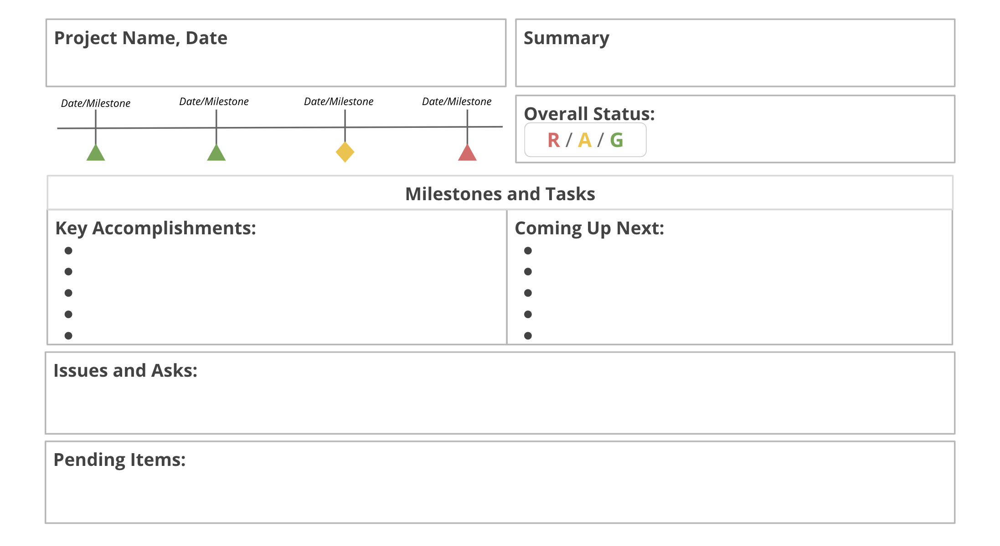
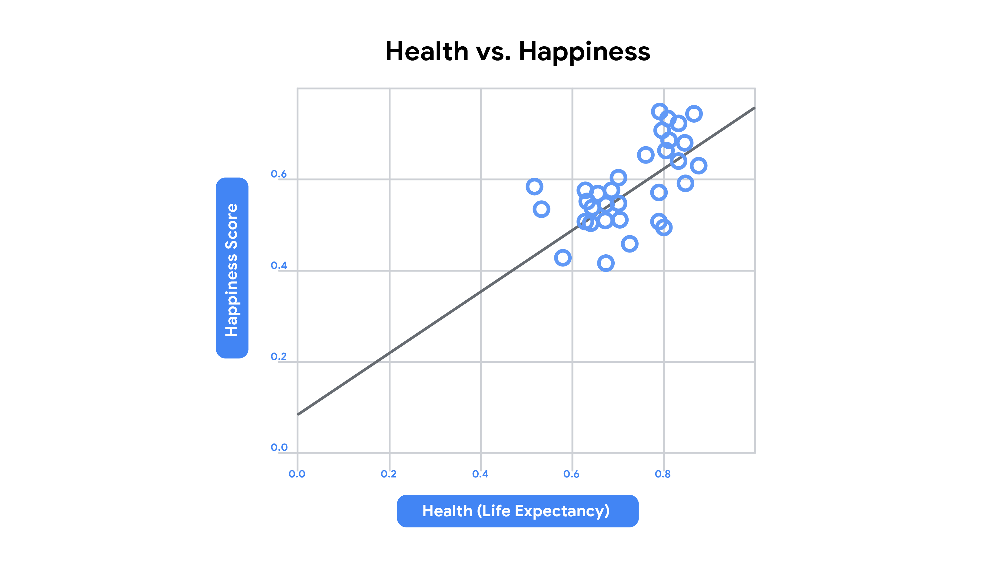

# Module 1

## Tracking progress
There are different ways to track projects, each having its own advantages and disadvantages.

### Gantt Chart
- Keep track of the schedule
- Good for project with lots of tasks, dependencies and milestones
- For large teams because responsibility are clearly laid out

Tools like Asana are good for creating gantt chart, as well as google sheet and microsoft excel

### Roadmaps

- High-level tracking of milestones
- It outlines the whole project and provides snapshot of key points
- It helps the stakeholder view how the project will evolve over time

Everything to know about roadmap on [smartsheet](https://www.smartsheet.com/content/project-roadmap-templates)

### Burndown charts
This is used by Agile Scrum teams, and useful for
- Detailed review of tasks
- When finishing on time is top priority

[Burndown](https://www.projectmanager.com/blog/burndown-chart-what-is-it) chart and how to use them on [Jira](https://www.atlassian.com/agile/tutorials/burndown-charts)

## Project status report

This gives you an overview of the project's elements and summarises them in snapshots. It should contain the following

1. Project name
2. Date: the status report is made many times throughout the implementation of the project, hence you need attack date. Report should be make regularly  e.g. weekly or monthly
3. Summary: Goals, schedule, highlights and lowlights.
4. Status: Illustrates actual progress, a common way is using RAG (red, amber and green). Red indicates significant issue that may impede or cause the project to go over budget, amber/yellow are usually schedule or budget issues that are minor and can be corrected while green means everything is alright.
5. Milestones and tasks: You don't go into full details, mainly you just indicate **key accomplishments** for completed milestones and **upcoming** for ongoing milestones
6. Issues: current roadblocks and potential risks. Here you can add ROAM analysis

Status report is not just a way to let your stakeholder know what's going on, it is also a way to set expectations for your stakeholder and an opportunity to ask for any resources that you may need.

Status report may be formatted in a variety way. A spreadsheet might be more detailed while a slideshow may be easier to communicate updates

## ROAM analysis

This is used to categorise the current issues facing the project and how they've been handled. there are four categories

1. Resolved: The issue has been fixed, no longer a problem
2. Owned: Someone has been assigned to fix or address it
3. Accepted: There is nothing that can be done about the issue
4. Mitigated: The effect has been reduced

## Escalation email

Escalation is the way to enlist the help of upper management. The following are best practices for escalation emails
1. Maintain a friendly tone: Don't get straight to business even though it might be time sensitive and don't apportion blame
2. State your connection especially if you are and the stakeholders are not very familiar with each other. It should be brief, perhaps a single line
3. Explain the problem: be concise as possible
4. Explain the consequences: how the issue will negatively the project
5. Propose a course of action and make your request

# Module 2

## Quality Management Concepts
There are four main concepts of quality managements

1. Quality standards: requirements, specifications, guidelines. You will set the standard for your team at the beginning of the project, this leads to less rework and delays
2. Quality planning: The process of identifying, determining and establishing Quality standards
3. Quality Assurance: A review process to determine if the project is moving towards delivery high-quality products. It's a regular audit to determine if the standard will be met
4. Quality control: This is used to ensure that the product meets the desired result, QA focuses on before while QC focuses on after the product has been produced. They also identify any defects and how to fix it

- [What Are Quality Standards](https://asq.org/quality-resources/learn-about-standards)?
- [What Is a Quality Plan](https://asq.org/quality-resources/quality-plans)?
- [Quality Assurance & Quality Control](https://asq.org/quality-resources/quality-assurance-vs-control)?

## User Acceptance testing (UAT)
There are different ways to measure customer satisfaction like surveys and UATs. The goal of UAT includes
- Demonstrating that a product/service/process worked in an expected manner in the real world.
- That it is working as intended
- Identify issues that needs to be addressed

This is basically a way to gather information on how the customers are using the product, and helps answer the following questions
1. Do users recognises the product and it's uses
2. How did they interact with it
3. How long do they interact with it
4. Did they notice all its features
5. Is it accessible to everyone

### Best practices of UAT
- Define and write down acceptance criteria
- Create a test cases for each item in the acceptance criteria
- Select your users: it should represent who your customers would be
- Write a UAT scripts based on user stories: These are informal, general explanation of a feature from a user's perspective
- Communicate with users to let them know what to expect
- Prepare the testing environment for UAT
- Provide a step-by-step plan to help guide users through the testing process
- Compile notes in a single document

### Managing UAT feedback
These are the things you'd expect to get from UAT other than positive comments
- Buts and issues: It should be sorted based on how critical they are, and the most critical ones should get priority
- Change request: some minor changes to the product, this should be prioritised and shared with the shareholders

# Module 3

## Basic terms

1. A milestone is a productivity metric. Milestones are important points within the project schedule that indicate progress and often signify when a team completes a deliverable or phase of the project.
2. A task is a productivity metric. Project managers assign tasks to project team members for them to accomplish within a set period of time.
3. A projection is a productivity metric. This metric helps you analyze current information to predict future outcomes.
4. Duration is a productivity metric. A project’s duration is the total time it takes to complete a project from start to finish. Duration can also be used for tasks.
5. Number of changes is a quality metric. Changes show any inconsistencies from the initial requirements of the project.
6. An issue is a quality metric and is known as a real problem that may affect the ability to complete a task.
7. Cost variance is a quality metric and illustrates the difference between the actual cost and the budgeted cost.

## Data, Metrics and Analytics
There are many types of project data to show team's progress and efficiency in order to evaluate the success of the project.

### Data
This is just information like numbers and feedback for different aspect of your project.

### Metrics
This is how you measure your data, this define the importance of specific information (data) and what you need to know about them. There are different types of metrics

- Productivity metric: measures progress using output over time. It enables prediction of effectiveness and efficiency. Predicting the future might be impossible, but it helps with projection. The data are usually
  - number of tasks or milestone completed in a given time.
  - on time completion rate to see if they are meeting deadlines
  - Duration: how long the project is taking
- Quality metric: this involves measuring the achievement of acceptable outcomes. This includes
  - Changes: difference between planned/required from the actual project
  - Issues: the number of problems affecting task completion
  - Cost/Budget variance: the money spent and the actual budget
  - Happiness and Satisfaction: measures overall user satisfaction like visual appeal, recommendation, ease of use etc. This could be classed under its own metrics, happiness metrics
  - Customer satisfaction scores: attitudes, satisfaction and eas of use
  - Adoption and engagement: adoption indicates whether the product or services is accepted/used, Engagement is to what degree people use it.
- Adoption metrics: each product or service will define its own set of successful adoption metrics like
  - Conversion rates
  - Time to value (TTV)
  - Onboarding completion rates
  - Frequency of purchases
  - Providing feedback
  - Completing a profile
- Engagement metrics: like adoption metrics, the product determine how it would be measured

### Analytics
Using data to answer questions, discover relationships and predict unknown outcomes. It is basically "What do the metrics mean to you?". It enables us to make decisions based on the metrics

## See more

- [A Comprehensive Guide To Project Management Metrics](https://www.wrike.com/blog/what-are-project-management-performance-metrics/)
- [Data-Driven Project Management: The 4 Most Important Data Points to Look At](https://top5projectmanagement.com/articles/data-driven-project-management-the-4-most-important-data-points-to-look-at/)
- [Project Analytics: Benefits, Challenges and First Steps](https://aliresources.hexagon.com/articles-blogs/project-analytics-benefits-challenges-and-first-steps)
- [Project Analytics to Improve Project and Portfolio Decision Making](https://www.pmi.org.in/conference2017/pdfs/papers-pdfs/theme-3-rapidly-changing-world/21-Project-Analytics-to-Improve-Project.pdf)
- [Project Management Metrics](https://business.adobe.com/blog/basics/metrics)
- [Productivity Metrics: Why They’re Important & 4 Examples](https://www.ringcentral.com/us/en/blog/productivity-metrics/)

##  Data Ethics

Data collection and analysis is an important part of project management but a lot of the data we collect contains PII (Personally Identifiable Information) which means we have to be responsible with the data. Hence ethics is important. Some ethical practices includes
- Complying with regulations
- Show that you are trustworthy
- Ensure fair and reasonable data usage
- Minimize bias
- Develop a positive public perception

Data ethics focus on two principles: **Data privacy** and **Data bias**

### Data Privacy

This is a key part of data ethics. This includes data collection and processing, preferences, managing personal data and rights of individual. You can achieve this through the following
- Increasing data privacy awareness: making sure every member of your project team knows this, including those outside of your organisation. You can set protocols and policies for them
- Using security tools: Like encryption, password managers, adjusting privacy settings on tools like Google Workspace
- Anonymising Data: using techniques like blanking, hashing or masking personal data. This will allow you to share data more freely without revealing personal information

### Data Bias

Because data affects decisions we make in the project, if there is a bias in collecting the data, we may make decisions that are bias. There are different types of bias
- Sampling bias: not representative of the population e.g. excluding certain age groups or socio-economic groups
- Observer bias: people observe things differently and may draw different conclusion based on their own bias
- Interpretation bias: not all data have obvious positive or negative interpretation, there are usually more than one way to interpret data.
- Confirmation bias: the tendency to look for interpretation that confirms pre-existing beliefs. For example, asking certain questions or giving weight to certain responses

## Data Analysis

There are 6 steps

### 1. Ask

Key questions to frame your analysis. You want to be as specific as possible, focus on the problem, not the symptoms. For example if you're losing gym members, the focus of the question shouldn't be "Why are we losing members?" but "What is negatively affecting gym members experience?"

### 2. Prepare

Collection and Storage of data. This is where you collect data, do surveys etc.

### 3. Process

This is where you clean your data.

### 4. Analyze

Look at data and draw conclusions, make predictions and decide on the next step

### 5. Share

You will need to share your findings with stakeholders. This is where you will use data visualisation to organise your data in a digestible format for your audience.

### 6. Act

Make data driven business decision based on your data analysis

## Presenting data

### Showing relationship

This is achieved using scatter plot, comparing two variables

### Comparing values

We can use Bar graphs to compare values by contrasting size

#### Bar graph best practices:
- Use consistent colors throughout the chart
- Use accent colors to highlight important data points or changes over time
- Use horizontal labels so it is easier to read

### Demonstrating composition
If you want to show composition, the share of something as part of the whole, use pie chart or donut chart

#### Pie chart best practices:
- Avoid including too many categories so it is easy to compare slices
- Make sure that the slice values add up to 100%
- Order slices according to their size

### Analysing trends and Behaviour

This can be achieved using line graphs

#### Line graph best practices:
- To avoid clutter, don't show more than four categories.
- Organize highly variable data at the top of the chart to make it easy to read

- [Creating charts on Google Workspace](https://support.google.com/docs/answer/63824?co=GENIE.Platform%3DDesktop&hl=en)
- [Creating charts on Microsoft office](https://support.microsoft.com/en-us/office/create-a-chart-from-start-to-finish-0baf399e-dd61-4e18-8a73-b3fd5d5680c2)

### Burndown chart

A graphical representation of work left vs time

## Presentation

Delivering presentation is key work of a PM. Here are the following things to consider for presentations.

### Preparation

- Be clear on the goals and purpose of presentation
- Seek inputs from stakeholders
- Set expectations of what is expected from you
- Create delivery plan
- Be mindful of your audience's time
- Try and make presentation memorable

### Practice

- Guide your audience through your presentation
- Do mock presentation with your team
- Schedule time to practice
- Be prepared for surprises

### Presentation and pace
- Get right to the point
- Check your pace, be mindful of clues from audience and adjust accordingly
- Usually, an audience should be able to understand your slide within 5 seconds

### Follow up

If appropriate, send follow up email with summary notes, action items and time frame. You can ask for feedback.

## Importance of Teamwork

There are 5 factors that impact team effectiveness

- Psychological safety
- Dependability
- Structure and Clarity
- Meaning
- Impact

## Air cover

Most of the job of a PM involves managing their team and overseeing their work but it also involves managing the needs and expectations of those above you. While the expectations of your stakeholders is important, you have to draw a line something and choose to protect your team, this is referred to as air-cover. There are some risks involved though, you don't want to fail to meet basic needs or cover their incompetencies. Air cover is important to protect team against out-of-scope request, but make sure your team is making the right progress

- Saying "No" without saying "No", like delaying, telling them you will consider it, get back to them etc
- Intervening behind the scenes

## Stages of team development

There are four stages
1. Forming: Everyone is new and you are setting the tone for everything
2. Storming: Now the team knows what is required but the are 100% yet. Cracks will show at this stage and adjustment may be required to make sure everything runs smoothly
3. Norming: All the kinks have been fixed, now everyone is doing what they are supposed to do and are fully optimised.
4. Performing: Team is committed to project and even going out of their way to make things better. Little or no oversight is required.

## Ethics framework
This is how you ensure you ar ethical in your organisation

1. Stay updated, identify any ethical issues
2. Learn everything about the issue
3. Evaluate all options and consider the following
  1. Which option will produce the most good and do the least harm?
  2. Which option best respects the rights of all who have a stake?
  3. Which option treats people equally or proportionally?
  4. Which option best serves the community as a whole, not just some members?
  5. Which option leads me to act as the sort of person I want to be?
4. Make your decision based on your evaluation
5. Reflect on the outcome, what you get wrong and what went well

## Act of Persuasion
As a PM, you have to convince people to agree with you, either your customers, the stakeholders or the team. According to Jay Conger, this are the four steps to achieving that according to the Article, The Necessary Art of Persuasion, Jay A. Conger

1. Establish credibility: Let them know that you know what you're doing but proving your expertise and establishing relationship between them. You need to earn their trust
2. Common ground: You need to convince them that it's good for their own sake, not because you think it's good. You don't just dismiss their idea, but let them know why and how your suggestion might be better suited to achieve their goals
3. Provide evidence: Combining hard evidence with emotionally resonant language that uses examples and anecdotes.
4. Connect emotionally: strike the right emotional tone, read the room, feel what they want, for example, do your audience want to scared or motivated etc

# Module 5

## Principles of Effective Email Writing

- State what you want clearly
  - Include request in subject line
  - State request within the first two paragraphs
  - Indicate call-to-action e.g. Reply, Review, RSVP
  - Define terms, avoid acronyms and terminology
- Keep the content short and concise
  - Try and make your email stand on its own, without requiring outside message to grasp the information
- Structure your writing
  - Use bullet with strong action verbs at the start of each bullet
  - Use labels to id most important info
  - Add hyperlinks to access additional information
  - Place central idea as a strong topic sentence
- Check grammar, punctuation and spelling

## Facilitating Inclusive and Accessible meetings

### Creating an inclusive environment
- Make sure everyone knows what is needed, don't assume they should know
- Give everyone your full attention
- Help all participant to be heard
- Make participant feel comfortable sharing different perspectives
- use images that reflect diversity of the world

### Make it accessible
Consider the following when planning for meetings

- Visual impairments and blindness
  - Use large fonts (>= 22pt), high contrast
  - alt text for graphs, tables, images etc
  - electronic version for e-reading, and ahead of time to let them prepare
  - For printed materials, (>= 18pt), black lettering on white matte paper, avoid italics and compressed fonts, use 1.25 to double spacing between lines
- Hearing loss and deafness
  - Face the person you're communicating with, speak clearly with moderate pace and volume. Add CC or subtitles to videos
- Mobility disabilities
  - Offer accessible seating location, and easy navigation
- Neurological disorders
  - You may need to tailor some aspect to their condition.
  - Use all possible media like video, audio, print outs etc
  - Avoid too much animation or flickering, or annoying background audio

## Productive meetings

Do the following to have a productive meeting

### Before the meeting
- Prepare an agenda that states the purpose and goals of the meeting, and share the agenda with participants.
- Only invite people who need to be there and who can help reach the goals of the meeting. Make participants’ roles and responsibilities for the meeting clear. Add non-essential participants as optional to the meeting invitation.
- If you are working with people in different time zones, share the time zone burden by alternating recurring meeting times.
- Evaluate the need for the meeting and cancel if it isn’t necessary. Consider whether the meeting content can be covered via email.
- Schedule shorter meetings. Meetings tend to expand to the time allotted to them, so try to get more done in a shorter amount of time.
- Set aside time to prepare for the meeting. Read the necessary materials, review the agenda, and come ready to participate.

### During the meeting
- At the beginning of the meeting, clearly state the meeting goals. Stick to the agenda throughout the meeting to avoid getting derailed. For recurring meetings, review the action items from the previous meeting to ensure accountability.
- Encourage participants to put phones and laptops away during meetings and silence notifications, if possible.
- Practice and demonstrate active listening. Respond verbally (e.g., “That makes sense. Tell us more.”) and non-verbally (through head nodding and eye contact) to show engagement.
- Encourage participation and give everyone a chance to speak, including remote participants. Ask open-ended questions like, “What does everyone think?” instead of “Does everyone agree?”
- Help everyone relax and feel more comfortable by starting meetings with open-ended, personal questions like, “How was your weekend?”
- Capture key points, action items, and decisions from the meeting, and assign action items to the appropriate meeting participants.

### After the meeting

- Recap key decisions, action items, timelines, and notes and send out to participants.
- Schedule necessary follow-up meetings with relevant context.
- Assess the need for and frequency of recurring meetings. Schedule meetings less frequently, if possible.

# Module 6

## Closing a project

This is an extremely important part of a project. There needs to be a point where the project officially ends. Without a closing, stakeholders might continuously ask for new features or more from the team.
If you feel that there are somethings that needed to be added but outside of the initial scope, it will be better to close the project and create a new project where this new things could be added after proper consideration. Before closure, you must ensure that:

1. All work is done
2. All agreed-upon project management processes have been executed
3. You have received formal recognition and agreement from key stakeholder that the project is done

If you don't properly close a project, it may have serious effect on your organisation's profitability and success. Your job as PM is not completed until you closed the project. Of course, before closure, make sure there is no oversight as this may have some negative consequences like

- Impact the product’s or service’s scheduled launch dates.
- Put your organization at legal risk.
- Result in significant financial losses to your organization.
- Undermine your team's credibility, and yours.
- Damage your relationship with the customer or client.