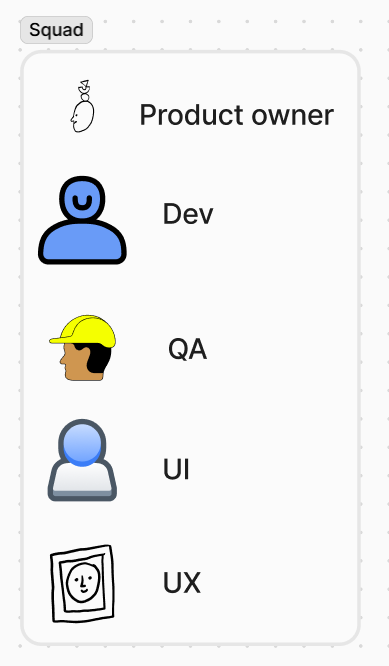
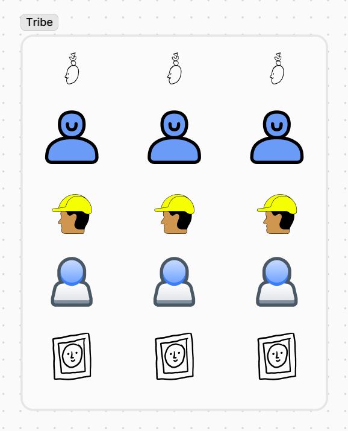
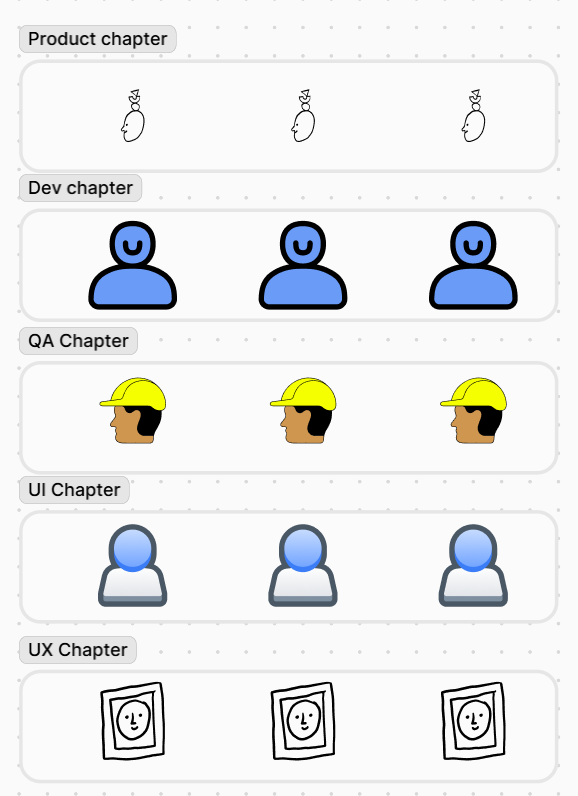
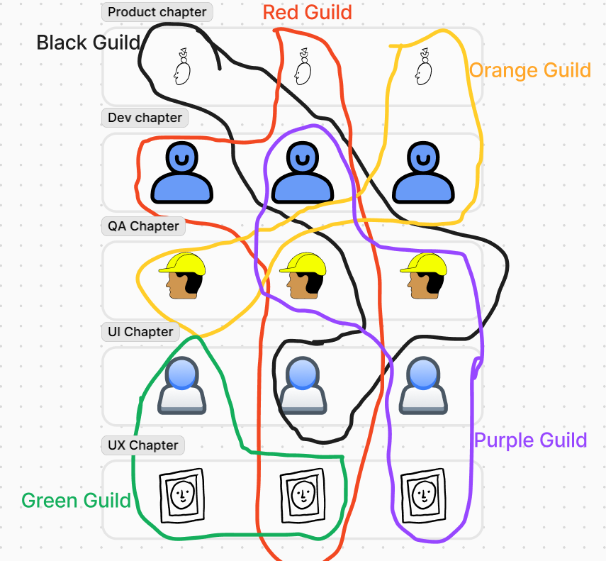
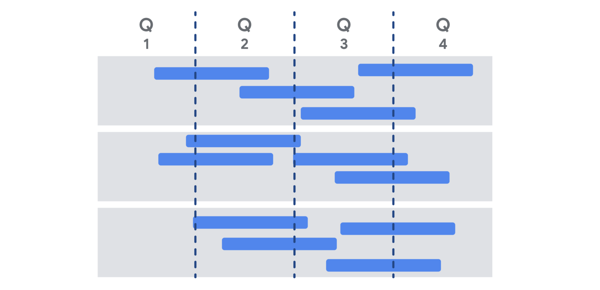

# Module 1

## Difference between Agile and Waterfall

## Agile manifesto

It could be found [here](https://agilemanifesto.org/)

- **Individuals and interactions** over processes and tools
- **Working software** over comprehensive documentation
- **Customer collaboration** over contract negotiation
- **Responding to change** over following a plan

### The principles behind the Agile Manifesto

Full principles can be found [here](https://agilemanifesto.org/principles.html). Below are the summaries

- Continuous delivery
- Welcome change in requirements
- Deliver frequently in small doses
- Business people and developers should work side by side
- Motivation is important
- Face-to-face conversation is the best
- A working software is best measurement of progress
- It's important to maintain const pace, indefinitely
- Continuous attention to excellence
- Simplicity is essential
- Good work comes from a team that coordinate itself
- Regular reflection is important

### VUCA

VUCA stands for volatility, uncertainty, complexity, and ambiguity. VUCA defines the conditions that affect organizations in a changing and complex world and helps teams account for these changes in projects.

# Module 2

## Scrum

This is the most popular implementation of Agile methodologies. It requires the following as described [here](https://hbr.org/1986/01/the-new-new-product-development-game):
- Built-in instability: Dynamic enough to handle challenging situations
- Self-organizing teams: lacks true hierarchy
- Overlapping development phases: A collective pace where the worst performer is not far behind the best performer. Everybody is in sync
- Multi-learning: Trial and error, staying up to date and responding quickly to changes and new information
- Subtle control: Though it lacks true hierarchy, leadership is still there but shouldn't hinder creativity
- Organizational transfer of learning: learn something new and be ready to support other team members to learn as well

## Spotify model

The full description of the model can be found [here](https://blog.crisp.se/wp-content/uploads/2012/11/SpotifyScaling.pdf). So what it boils down to is the following

- Squads
- Tribes
- Chapters
- Guild

### Squad

It's a unit, like a scrum team or a small startup, they work on a long  term mission and usually focus on one aspect of Spotify. They do not have a leader but have a product owner that communicates with other product owners to ensure collaboration and track Spotify progress as a whole. So we can have a squad in charge of web-dev and other squad in charge of android dev and another squad in charge of backend or payment service. Each team also has access to an agile coach to enable continuous improvements

### Tribe

This is a collection of squads that work on a specific area, e.g. the frontend guys that works on web, android and ios. It is meant to have less than 100 people.

### Chapter

This is a collection of people across squads in a tribe with similar skills or work in general e.g. JS developers. This allows them to interact and learn from each other

### Guilds

Squads, Tribes and Chapters seems to segregate a lot of the workers. Guilds is the largest group and is meant to comprise of people across the organisation so that they can share knowledge, tools, code, and practices. It is also a way for you to mingle with those outside your field and engender company spirit rather than tribalism

## Roles in Scrum team

### Scrum master

Helps the team follow scrum theory, and adhere to scrum practices like keeping a meeting within appropriate timebox. They also coach team members in self-management and identify any impediment or why a member is falling behind

#### vs Project manager
Though the two roles share similar skills and qualities, SM is about helping the team understand Scrum theory and practice and do not maintain traditional project artifacts like Gantt charts.

### Product Owner
They are responsible for maximising the value of the product. While the SM is focus on efficiency, the PO is focused on quality and spec of the product. They set product expectations, create product backlog and ensure that needs is transparent and understood

#### vs Project manager
Scope management which is the primary role of the PM falls on the shoulder of the PO, they also liaise with stakeholders and must facilitate effective communication among team members and stakeholders. Conversely, PO are not managers, so they are not responsible for the team performance.

#### Product manager
This is found in really big companies like Google. They are responsible for defining product or solution scope. Hence, whenever you join a company, it's important to know what your role entails as the definition is not always fixed.

Usually, the role of PM is divided 2 way between PO and SM, but can be divided 3 ways including Product manager

### Development Team
The developers who build the actual product. They create sprints and execute it by designing, building, and testing items in increments

There are different characteristics for different roles. More can be found [here](https://www.infoq.com/articles/great-scrum-team/).

## Pillars and values

To recap, every person on a Scrum team subscribes to the three pillars and the five values of Scrum.

The three pillars of Scrum are:

- Transparency
- Inspection
- Adaptation

The five values of Scrum are:

- Courage
- Commitment
- Focus
- Openness
- Respect

Take a deeper look at the framework in the [Scrum Guide](https://scrumguides.org/scrum-guide.html). For further reading about [Scrum](https://www.scrum.org/learning-series/what-is-scrum/), check out Scrum.org

# Module 3

## Product Backlog

A very important scrum artifact is the Product backlog. It is an ordered list of what needs to be done to improve the product and achieve the product goal.
So while you should sort it according to importance, using different models like Kano models, you should also include an estimate of how long it will take.
The product owner is usually in charge of Product backlog.

## User stories
There are short, simple descriptions of a deliverable told from the perspective of a user. This helps the develop team create a product centered around the user's need and experience.

**Epics** are collection of user s tories that are related. An epic gives a high level view of the overall arc.

When writing user persona, it should include the following

1. User persona: What is the user like, it should relate to the product, what is their goal?
2. Definition of Done: The set of items that must be completed before the user story can can be considered done
3. Tasks: What are the key activities that needed to be completed
4. Feedback: If you are adding a new feature to an existing product, then you can add feedbacks from previous iterations

User stories should be **INVEST**
- Independent: The story does not depend on another user story
- Negotiable: There should be room for discussion
- Valuable: It should provide a value
- Estimable: The **Definition of Done** should be clear so that the team can give user story an estimate (cost, importance etc)
- Small: It should be able to fit into a planned sprint
- Testable: there is a way to check if they meet the criteria

Note, **Epic** is just a collection of stories, and can not be used in itself by dev team. But it can be used to group related stories. Anyone in the team can write user story, but the backlog that may arise from it is still the purview of the Product owner.

## Estimating efforts

There are several ways to estimate how long it will take to finish a task. Some techniques includes the following
- [Planning Poker™](https://www.mountaingoatsoftware.com/agile/planning-poker)
- Dot Voting
- The Bucket System
- Large/Uncertain/Small
- Ordering Method
- Affinity Mapping

To get a good estimation, do the following
1. Avoid gathering false precision of estimates. Rough estimate will usually suffice, and try to get an absolutely accurate estimation might take too much time and the team ends up wasting too much time and miss the deadline
2. Avoid anchoring bias: this is when an individual put forward an estimate based on what other people say in order to avoid embarrassment or conform.
3. Promote inclusivity: this also help develop trust and cohesiveness
4. Leads to effort discovery: Estimation process might leads to suggestions that may make the development more efficient.

## Sprint Overview

Sprints are the heartbeat of Scrum. They have a fix lengths, usually between 1 to 4 weeks to create consistency. A new sprint starts immediately after the conclusion of the previous sprint

Various practices exist to forecast progress like burn-downs, burn-ups, cumulative flows.

A sprint can be cancelled if the sprint goal becomes obsolete. Only the Product Owner can do this.

During a sprint

- No changes are made that would endanger the Sprint Goal;
- Quality does not decrease;
- The Product Backlog is refined as needed; and,
- Scope may be clarified and renegotiated with the Product Owner as more is learned.

## Releasable Increment vs Minimum Viable Product

### Potentially releasable product increment

Every sprint should result in addition to a product or solution, those incrementally add more features that may be released eventually.

### Definition of Done

It is the requirements that shows that a backlog item has been completed. In software, this usually involves completion, review and testing.

### Product increment

Not every increment is shipped or release. To decide whether an increment will be released, you should consider the following

1. Is the increment complete?
2. Will it bring value and does it meet quality measures? Has it been well-tested?
3. Is it usable by the end user? Can we use their direct or indirect feedback to improve future versions of the product?

## Sprint Retrospectives

They occur at the end of each sprint, they are workshops that give the team time to reflect on a project, and brainstorm potential future improvements. They are an essential part of the Scrum practices and happens a lot, so there are some pitfalls that should be avoided

### Pitfalls
- Using gimmicks: because of the nature, scrum masters may use gimmicks to make the retrospective more fun. Don't use too much gimmick and consider the team you have. Some of them may appreciate just getting to the point
- Focus on the negative: It's necessary to recognise what went wrong, but you should also highlight where they exceeded expectations
- Avoid changing processes after each retrospective: while it's OK to try new things from time to time, you should try and minimises changes to retrospectives

### Best practices

- Ask open-ended, probing question
- Use diverse style of communication and participation
- Cover as many aspect as possible like
  - The productivity and efficiency of the team
  - The scope and understanding of the definition of done
  - Communication and interactions within the team
  - Stakeholder communication
  - Progress towards more long-range release plans
- Reflect on Scrum theory, and how well the team is adapting

## Scrum tools

### Velocity

This refers to how many story points the team burns down in a given Sprint on average. It measures the amount of work a single team can be expected to complete in an iteration.
Story points is defined as the estimated effort for each backlog item. By figuring out a teams velocity, it will be easier to determine what to include in a particular sprint.
For example, a team that completes 10 story points per sprint, should include backlog items that is around 10 points.
Of course, this is effective when your backlog is properly prioritised, so that you can fill in the sprint with the most important items that falls within that story point.
It is important to prioritise your backlog items (backlog refinement), and continuously review it.

#### Dos and Don'ts
- Be careful with who you share it: Especially with external shareholders, only share it when absolutely necessary
- It is not a performance metric. Different teams, tasks, and estimation determines the velocity.
- It is not to be used for comparison: You shouldn't use to compare two scrum teams.
- Don't use it to estimate delivery date: You can use it to estimate, but be careful when making promises

[Summary of Agile development](https://www.youtube.com/watch?v=502ILHjX9EE)

# Module 4

Agile and Scrum are value driven, and as you pursue a career in PM, you can learn how Agile brought value to an organisation using case studies.

## Case studies
In depth, data-driven analyses of business, community or organisation. When reviewing case studies, there are some takeaways that you should ask yourself about

- What is the issue?
- What is the goal of the analysis?
- What is the context of the problem?
- What key facts should be considered?
- What alternatives are available to the decision-maker?
- What would you recommend, and why?

Below is an example of a [case study](https://scrumorg-website-prod.s3.amazonaws.com/drupal/2020-04/Penta_April2020-2.pdf)

## Roadmaps

These are very important in any long-running projects. Depending on the company, they may be referred to as any of the following

- Project roadmap
- Product roadmap
- Value roadmap
- Lean roadmap
- Agile roadmap

Roadmaps creates a big picture of the product and the timeline

### Benefits

- Clarifying the sequence of deliverables
- Showing teams how their efforts relate to the north-star vision. In other words, their ultimate goal.
- Showing stakeholders the incremental value that will be achieved over the course of the project (rather than reviewing it as one big delivery at the end)
- Helping stakeholders roughly understand the layout of the work behind the deliverable

### Pitfalls
- The stakeholders might think it's fixed and unchangeable. This might put pressure on the team to achieve deadlines that are impossible
- Spending too much time fine-tuning delivery dates
- Putting all the work into creating roadmaps rather than deliverables

### Best practices

- Make it highly noticeable to the team and refer to it frequently.
- Clearly indicate the highest priority items.
- If possible, clearly indicate the highest value items.
- Make it visible to your wider stakeholder group so that they can use it for their planning.
- Conduct regular reviews of the roadmap with sponsors, stakeholders, and the team to ensure that it is still providing the blueprint for the project.

Learn more about [Roadmap principles](https://www.scrum.org/resources/blog/product-roadmap-first-principles-empower-scrum-teams-align-w-stakeholders)

### Summary

Roadmaps are important in well-managed project, helps agile teams stay motivated and gives them sense of accomplishment as the roadmap deliverables are achieved