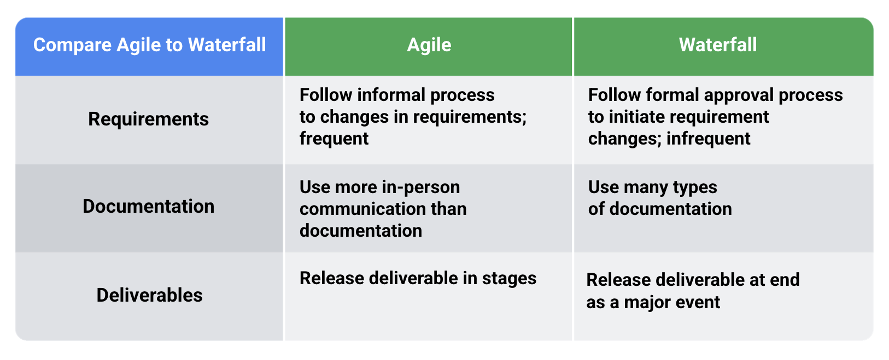

# Module 1

## Difference between Agile and Waterfall

## Agile manifesto

It could be found [here](https://agilemanifesto.org/)

- **Individuals and interactions** over processes and tools
- **Working software** over comprehensive documentation
- **Customer collaboration** over contract negotiation
- **Responding to change** over following a plan

### The principles behind the Agile Manifesto

Full principles can be found [here](https://agilemanifesto.org/principles.html). Below are the summaries

- Continuous delivery
- Welcome change in requirements
- Deliver frequently in small doses
- Business people and developers should work side by side
- Motivation is important
- Face-to-face conversation is the best
- A working software is best measurement of progress
- It's important to maintain const pace, indefinitely
- Continuous attention to excellence
- Simplicity is essential
- Good work comes from a team that coordinate itself
- Regular reflection is important

### VUCA

VUCA stands for volatility, uncertainty, complexity, and ambiguity. VUCA defines the conditions that affect organizations in a changing and complex world and helps teams account for these changes in projects.

## Scrum

This is the most popular implementation of Agile methodologies. It requires the following as described [here](https://hbr.org/1986/01/the-new-new-product-development-game):
- Built-in instability: Dynamic enough to handle challenging situations
- Self-organizing teams: lacks true hierarchy
- Overlapping development phases: A collective pace where the worst performer is not far behind the best performer. Everybody is in sync
- Multi-learning: Trial and error, staying up to date and responding quickly to changes and new information
- Subtle control: Though it lacks true hierarchy, leadership is still there but shouldn't hinder creativity
- Organizational transfer of learning: learn something new and be ready to support other team members to learn as well